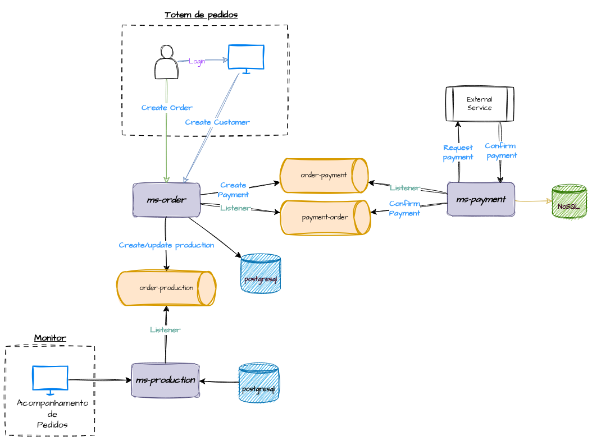
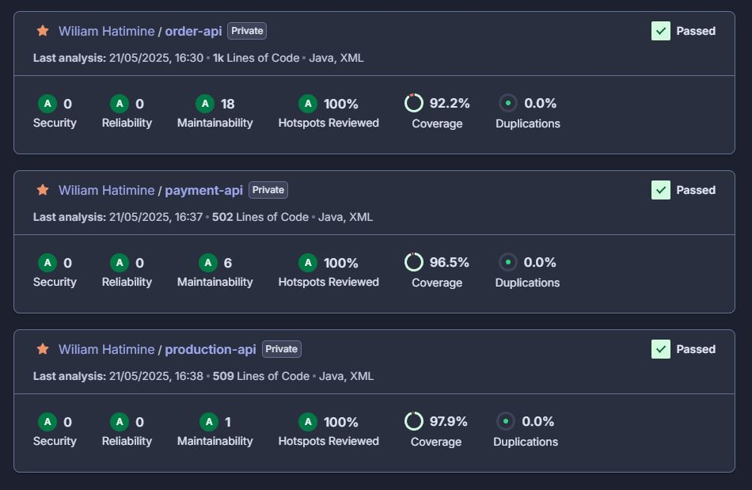

<h3 align="center">Pós Tech FIAP - Tech Challenge - Grupo 16</h3>

<h3 align="center">Descrição ⚡</h3>

<h3>Sistema desenvolvido para automatizar o gerenciamento de pedidos e o preparo dos lanches em uma lanchonete, organizando a fila de produção, otimizando o tempo de atendimento e melhorando a comunicação entre balcão e cozinha.<h3>

### 👨‍💼 Desenvolvido por

##  Vídeos

Os vídeos a seguir demonstram:
- Gerenciamento de produto
- O Fluxo da produção de um pedido
- Realização do pagamento
- Infraestrutura proposta na cloud AWS

[Fluxos de pedidos e gerenciamento de produtos e pagamento](https://youtu.be/aIOe3dQ67GI)
 
[Infraestrutura na cloud AWS](https://youtu.be/AsnitJU_k7Y)

### Repositórios

Ordem de execução: 
1. **[SQS](https://github.com/postech-architecture-group16/sqs-queue)** Criação das filas SQS
2. **[VPC](https://github.com/postech-architecture-group16/vpc)**: Criação de VPC
3. **[DB](https://github.com/postech-architecture-group16/postgres)**: Criação dos bancos de dados Postgres e DynamoDB
4. **[K8S](https://github.com/postech-architecture-group16/k8s)**: Criação da infraestrutura no EKS
5. **[Order-API](https://github.com/postech-architecture-group16/order-api)**: Microsserviço de gerenciamento de pedidos e produto.
6. **[Payment-API](https://github.com/postech-architecture-group16/payment-api)**: Microsserviço de gerenciamento de pagamentos.
7. **[Production-API](https://github.com/postech-architecture-group16/production-api)**: Microsserviço de gerenciamento do fluxo de produção do pedido.
8. **[Gateway](https://github.com/postech-architecture-group16/api-gateway)** Criação de API Gateway. 

### Diagrama - Fluxos

### SonarCloud - Cobertura dos testes

